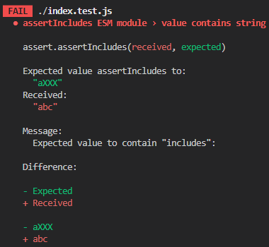

# assert-includes

> Assert string includes

Assert that an value is included in a string.

## Install

Most likely you want to use this package as development dependency.

```sh
npm install clean-stack --save-dev
```

Or with Yarn:
```sh
yarn install clean-stack --dev
```

## Usage

```js
import assertIncludes from 'assert-includes';

test("value contains string", () => {
  assertIncludes("abc", "a");
});
```

If the test fails, it will throw an `AssertionError`,
which can be picked up by your testing library.

For example with Jest, it will produce the following log:



## API

### assertIncludes(value, includes)

Returns `true` if valid or throws `AssertionError` if invalid.

#### value

Type: `string`

Value expected to contain the included text.

#### includes

Type: `string`

The text that is part of the `value`.
